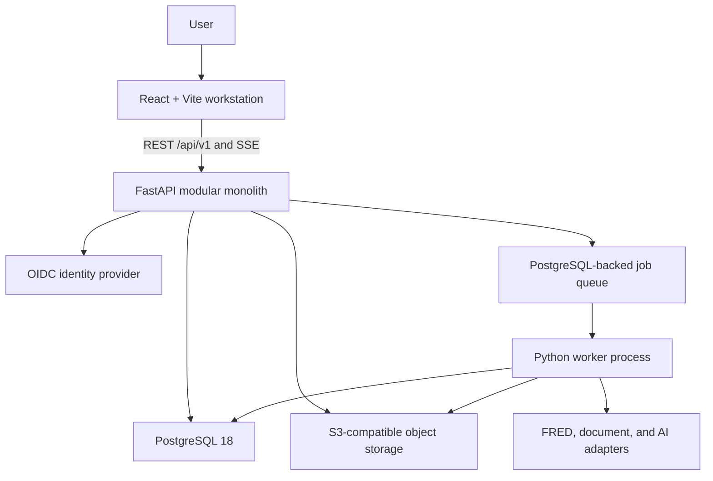

# JARVIS Phase 0 Architecture Proposal

- Status: Approved baseline
- Date: 2026-08-18
- Scope: Architecture and documentation only
- Product source: [Master project specification](../product/master-project-specification.md)

## 1. Executive decision

JARVIS will begin as a cloud-ready personal research application with a
multi-workspace data model from the first migration. It will be implemented as
a portable modular monolith:

- React, TypeScript, and Vite for the authenticated research workstation;
- FastAPI, Pydantic, SQLAlchemy 2, and Alembic for the API and domain services;
- PostgreSQL 18 as the structured source of truth;
- S3-compatible object storage for original documents, raw provider payloads,
  immutable datasets, and large analysis artifacts;
- a separate Python worker process, sharing the same domain packages as the
  API, when durable jobs are introduced;
- OpenAPI 3.1 as the source for generated TypeScript API clients;
- standards-based and replaceable adapters for identity, storage, secrets,
  jobs, data providers, document extraction, observability, and AI providers.

The initial deployment is one owner in one personal workspace. The ownership
and authorization model is nevertheless designed for multiple users and
workspaces so collaboration does not require a data migration later.

## 2. Why this architecture

The repository is greenfield, so there is no legacy stack to preserve. The
architecture optimizes for the product's actual shape: an authenticated,
desktop-first, information-dense workstation with substantial deterministic
Python analytics.

A Vite single-page application is preferred to Next.js because the product has
no near-term SSR or SEO requirement. It avoids a second server-side business
logic boundary and ensures the web, future desktop/mobile clients, agents, and
automations use the same API. A separate public site can be added later.

A modular monolith is preferred to microservices because transaction
boundaries, relational integrity, auditability, and low operational overhead
matter more than independent service scaling during product discovery. Module
boundaries are enforced in code and database ownership so selected workloads
can be extracted later without first paying distributed-system costs.

## 3. System context



The browser and `/api` are served under one origin. This supports secure
HttpOnly sessions and avoids broad cross-origin access. The worker is a
separate process, not a separate product service: it imports the same
application services and observes the same authorization and provenance rules.

## 4. Backend bounded contexts

The Python application is divided into these contexts:

- **Identity**: users, external identities, sessions, workspaces, memberships,
  roles, and permissions.
- **Platform**: module catalog, releases, dependencies, installations,
  navigation, settings, and feature configuration.
- **Knowledge**: taxonomies, concepts, definitions, formulas, methods,
  relationships, source authority, and citations.
- **Documents**: papers, object references, document versions, extraction
  runs, pages, chunks, and ingestion state.
- **Data**: providers, connections, source series, datasets, immutable
  snapshots, transformations, quality checks, and lineage.
- **Flows**: flow definitions, published versions, registered handlers,
  execution runs, step runs, and run artifacts.
- **Research**: projects, analyses, versions, experiments, notes, findings,
  and reports.
- **Analytics**: deterministic finance and statistics engines.
- **Search**: lexical search projections and the future semantic-search port.
- **AI**: provider-neutral conversations and tools that call application
  services.
- **Governance**: provenance, audit events, outbox events, and durable job
  records.

Each context owns its domain model, application services, ports, adapters, API
DTOs, and database tables. A context may call another context only through its
public application facade or a typed event. It must not import another
context's ORM models or repositories.

## 5. Frontend architecture

The workstation uses:

- React and strict TypeScript;
- Vite for development and static production builds;
- TanStack Router for typed application routes;
- TanStack Query for server state and cache invalidation;
- TanStack Table and Virtual for dense, virtualized data views;
- Radix primitives and project-owned design tokens/components;
- Apache ECharts for interactive finance and time-series charts;
- KaTeX for mathematical rendering;
- PDF.js for the paper viewer;
- React Hook Form and Zod for client-side form ergonomics;
- local component/URL state by default, with Zustand limited to ephemeral
  workstation layout state.

The client contains presentation and interaction logic, not financial,
statistical, authorization, workflow, or data-transformation business rules.
Frontend module keys resolve only to trusted, statically shipped lazy imports.

## 6. API architecture

The API is REST under `/api/v1` and is organized by domain rather than by page.
Pydantic request and response DTOs are separate from persistence models.

API conventions are:

- UUID resource identifiers and ISO 8601 UTC timestamps;
- RFC 9457 problem details for errors;
- cursor pagination for collections;
- optimistic version fields for mutable resources;
- idempotency keys for retriable creates and executions;
- `202 Accepted` plus a run/job resource for long operations;
- polling initially and Server-Sent Events for progress and AI streaming;
- no GraphQL or WebSockets until a measured use case requires them;
- no provider credentials or storage implementation details in public DTOs.

FastAPI emits the canonical OpenAPI 3.1 document. CI generates the TypeScript
client and rejects uncommitted drift or unapproved breaking changes.

See [Platform contracts](platform-contracts.md) for normative conventions.

## 7. Database architecture

One PostgreSQL database is divided into schemas aligned with bounded contexts.
One ordered Alembic history controls all schema changes.

Every private root resource carries a non-null `workspace_id`.
`created_by_user_id` records attribution but never defines ownership. Curated
system content resides in a read-only system resource namespace. Private
content resides in a workspace namespace.

A thin resource registry provides stable identity and graph linkability.
Typed subtype tables contain domain-specific data, avoiding entity-attribute-
value modeling. Published resource revisions, dataset snapshots, flow
versions, document extraction versions, and completed analysis runs are
append-only.

Relational columns store ownership, state, joins, constraints, frequently
queried properties, lineage, and run status. Schema-validated JSONB is limited
to cohesive versioned documents such as flow DSL, formula AST, module settings,
parameter manifests, and diagnostics. Large immutable payloads are stored in
object storage with hashes and metadata in PostgreSQL.

See [Data model](data-model.md) for the ERD and invariants.

## 8. Module architecture

Modules use a two-level registry:

1. A trusted code manifest declares module ID and version, dependencies,
   permissions, configuration schema, route/component keys, provider
   adapters, flow handlers, and AI tools.
2. Database records control installation, enablement, labels, ordering,
   navigation, and content configuration by workspace.

Configuration may select only allowlisted code keys. It cannot name arbitrary
imports or contain executable Python, JavaScript, SQL, or shell commands. This
makes navigation and content configurable without making PostgreSQL a plugin
runtime.

Finance areas such as Fixed Income and Equity Research compose shared
knowledge, data, flow, and analytics capabilities. They do not duplicate those
subsystems.

Workspace configuration is portable through a versioned
`jarvis-config.json` contract containing enabled module keys/releases,
navigation overrides, preferences, workflow defaults, and personal categories.
Export omits sessions, secret values, object URLs, and environment-specific
IDs. Import validates compatibility and presents a dry-run of installs,
updates, ignored settings, and unresolved dependencies before applying
changes. Credential bindings are reconfigured separately.

## 9. Flow and analytics architecture

A flow has a mutable workspace draft protected by optimistic locking. Drafts
are not executable. Publishing snapshots the draft into an immutable,
schema-validated flow version, compiles validated steps and edges, and pins
registered handler releases. Initial flows are directed acyclic graphs of
allowlisted step types.

Each handler release declares:

- stable key, semantic version, and code digest;
- configuration, input, and output schemas;
- capabilities and required permissions;
- deterministic/non-deterministic classification;
- timeout, retry, and idempotency policies.

No flow definition can execute arbitrary code. A run pins the flow version,
handler digests, inputs, dataset snapshots, transformations, parameters,
assumptions, random seed, outputs, warnings, artifacts, and step-level state.

Finance and statistics engines are pure typed Python packages independent of
HTTP, persistence, UI, and AI. Monetary/accounting operations use
`Decimal`/PostgreSQL `NUMERIC`; statistical linear algebra uses float64 with
declared tolerances. Conventions such as day count, compounding, calendars,
currency, annualization, and rounding are explicit inputs.

The engines initially execute in the API for short synchronous work and in the
shared-code worker for durable/heavy work; they are not a separate HTTP
service. This is the deliberate modular-monolith interpretation of the
specification's Python analytics service. A network service is introduced only
if resource isolation or independent scaling is demonstrated.

Reproducibility distinguishes replaying stored evidence, running a retained
execution image by digest, and rerunning a current compatible method. Exact
rerun is promised only while the pinned image/handler bundle is retained and
passes compatibility checks; otherwise JARVIS reports the available
reproducibility level rather than silently substituting current code.

## 10. Data-provider architecture

Providers implement capability-oriented ports for search, metadata,
observations, vintages, pagination, rate limits, and health. Provider-specific
DTOs do not escape their adapters.

Only provider-import orchestration handlers may call provider ports.
Analytical handlers consume immutable normalized dataset snapshots, preventing
a flow step from bypassing raw capture, normalization, quality checks, or
lineage.

Each import records:

- provider and source identifier;
- request parameters and credential reference;
- retrieval time and provider revision/vintage;
- immutable raw response and checksum;
- validation, normalization, and transformations;
- data-quality results;
- resulting immutable dataset snapshot.

Raw, normalized, and analysis-ready snapshots are connected by versioned
transformation runs. PostgreSQL stores catalog metadata and moderate
interactive time series. Larger datasets and results use content-addressed
Parquet/Arrow objects that workers can query with DuckDB.

FRED/ALFRED real-time periods and vintages are required before historical
backtests so revised observations cannot create look-ahead bias.

## 11. Document-processing architecture

Uploads enter a private quarantine prefix through short-lived signed URLs.
The API authorizes the upload, enforces edge-declared size/type constraints,
and records the pending object; it does not parse hostile PDF structure.
A no-egress quarantine verifier worker checks SHA-256, signature/MIME,
encryption, page/object limits, and malware policy before promoting the object.

A separately permissioned, sandboxed extraction worker performs page-aware
text extraction, optional OCR, metadata extraction, chunking, and indexing.
It records parser versions, layout/page locators, hashes, and failures.
Reprocessing creates a new extraction version; it never silently changes
existing citations. Provider-enabled workers do not share the parser worker's
network/IAM profile.

Chunk text, locators, checksums, and full-text projections reside in
PostgreSQL. Original PDFs and large extraction/layout derivatives reside in
object storage. PostgreSQL FTS and trigram search are the initial search
engine. Embeddings are added only after lexical relevance and citation
integrity are working.

## 12. AI and tool architecture

The model is an untrusted planner and explainer, not a calculator or source of
truth. AI tools call the same authorized application services as the API.
Models receive no direct database, filesystem, shell, arbitrary URL, or secret
access.

The first tools are read-only search and retrieval. Every response can retain
provider/model/version, prompt-template hash, tool calls, retrieved resource
revisions, paper pages, dataset snapshots, analysis run IDs, and output
status. Factual claims and citations require tool evidence. Output is labeled
as fact, calculation, inference, interpretation, or opinion. AI-created
knowledge remains draft until reviewed.

Uploaded documents are treated as hostile data, not instructions. Tool
authorization is repeated on every invocation.

## 13. Authentication and authorization

Authentication uses OIDC Authorization Code with PKCE. FastAPI owns the browser
callback and issues a revocable opaque `__Host-jarvis_session` cookie with
`Secure`, `HttpOnly`, and `SameSite=Lax`; only a versioned keyed-HMAC digest is
retained server-side. Login, callback, and logout live under
`/api/v1/auth/*`. The API allowlists issuers and validates signature/JWKS
rotation, algorithm, issuer, audience/authorized party, expiry, nonce,
single-use state/code verifier, authentication time, and required MFA
assurance. The personal launch allowlists the owner's `(issuer, subject)` and
uses provider-enforced MFA rather than open registration.

External identities are keyed by immutable `(issuer, subject)`, never email.
JARVIS owns Owner/Admin/Editor/Viewer roles and resource permissions. Workspace
context is derived from authenticated membership, not request-body fields.

Composite workspace-aware foreign keys prevent cross-workspace references.
PostgreSQL row-level security provides defense in depth using transaction-local
user/workspace settings. Application and worker roles do not own tables and
cannot bypass RLS.

Future desktop, mobile, and agent clients use an explicitly separate
standards-based bearer-token path.

## 14. Security model

Platform secrets live in environment or cloud secret management. User-supplied
FRED and AI keys use envelope encryption: ciphertext and key metadata in
PostgreSQL, master keys in KMS, and workspace/record/purpose bound as AEAD
associated data. APIs expose only configured status, fingerprints, and
rotation metadata.

Required controls include:

- TLS, strict transport and content security headers, Origin validation, and
  CSRF protection;
- least-privilege database, object-store, and workload identities;
- private buckets and short-lived signed object URLs;
- input/rate limits and upload parsing in a constrained worker;
- credential, authorization-header, document-text, prompt, and data-value
  redaction from default telemetry;
- encrypted backups, point-in-time recovery, and restore drills;
- dependency, secret, license, container, and SBOM scanning;
- append-oriented audit events separate from analytical provenance and
  operational telemetry.

See [Threat model](threat-model.md).

## 15. Repository structure

```text
apps/
  web/
  api/
  worker/
packages/
  ts/ui/
  ts/api-client/
  py/jarvis-core/
  py/finance-engine/
  py/statistics-engine/
  py/flow-engine/
  py/provider-adapters/
  py/document-pipeline/
contracts/
  openapi/
  events/
database/
  migrations/
  seeds/
docs/
  product/
  architecture/
  architecture/decisions/
  api/
  workflows/
infrastructure/
  docker/
  deployment/
tests/
  e2e/
  fixtures/
```

TypeScript uses pnpm workspaces; Python uses uv workspaces. Both dependency
graphs are locked. Root commands must work on Windows and in CI.

## 16. Testing strategy

Testing is risk-based:

- unit and property tests for pure finance/statistics/flow logic;
- authoritative golden vectors and independently implemented formula checks;
- provider and storage adapter conformance suites;
- PostgreSQL, object-store, migration, queue, and OIDC integration tests;
- mandatory RLS and cross-workspace adversarial tests;
- OpenAPI compatibility and generated-client drift tests;
- browser component/accessibility tests and Playwright golden-path tests;
- citation integrity, job idempotency, retry/recovery, and AI tool
  authorization tests.

See [Testing strategy](testing-strategy.md) and
[Numerical correctness policy](numerical-correctness.md).

## 17. Migration and content strategy

Alembic uses one ordered history with expand/backfill/validate/contract
changes. A single locked migration task runs before application rollout.
Production failures are forward-fixed; unsafe automatic downgrades are not a
recovery strategy.

Schema migrations are separate from idempotent, checksummed, versioned content
packages for modules, relationship rules, taxonomies, formulas, methods, and
flows. Published content receives a new revision rather than silent mutation.

See [Migration strategy](migration-strategy.md).

## 18. Deployment strategy

Local development uses Docker Compose for PostgreSQL, MinIO, API, worker, and
static web hosting. The first production profile uses static assets behind a
CDN/reverse proxy, API and worker containers, managed PostgreSQL,
S3-compatible storage, OIDC, KMS/secrets, structured logs, error tracking, and
OpenTelemetry propagation.

A container PaaS or small ECS/RDS/S3 deployment is sufficient. Kubernetes is
explicitly out of scope until independent services and operational scale make
it necessary.

See [Deployment strategy](deployment-strategy.md).

## 19. Architecture-validation MVP

The first golden-path increment proves that the platform feels integrated:

1. Owner login, personal workspace, module registry, settings, navigation,
   command palette, and search shell.
2. Seeded Yield Curve taxonomy, concepts, definitions, and formulas with
   provenance and relationships.
3. FRED/ALFRED retrieval, data-quality report, and immutable saved snapshot.
4. Generic Yield Curve Analysis flow, deterministic calculations, step audit
   trail, saved analysis, and reproducible rerun.
5. Paper upload, page-aware extraction, notes, and links to the same concepts
   and analysis.
6. Read-only contextual JARVIS explanation backed by entity, page, and dataset
   citations.

This increment is not the full specification MVP. MVP completion additionally
requires database-driven CFA and Master's hierarchies, Macro Time-Series and
Equity DCF as the second and third conformance flows, basic paper metadata and
notes, saved datasets, settings/configuration export, and the foundation
features listed in the master specification. The flow engine is not declared
stable until all three flows run without flow-ID-specific engine branches.

AI enrichment during paper ingestion—summary and candidate
concept/method/dataset links—follows page-stable extraction. Generated links
remain draft suggestions until reviewed; extraction and lexical search do not
depend on AI.

## 20. Implementation sequence

1. Complete and approve Phase 0 architecture documents and decision records.
2. Scaffold repository tooling, quality gates, Compose, CI, OpenAPI
   generation, and migrations.
3. Implement identity, workspaces, RBAC/RLS, and the platform/module shell.
4. Implement resources, taxonomies, typed knowledge, relationships,
   provenance, and lexical search.
5. Implement data-provider ports, FRED/ALFRED ingestion, immutable snapshots,
   transformations, and quality checks.
6. Implement the versioned flow engine and Yield Curve golden path.
7. Add page-aware document ingestion, Master's hierarchy, configuration
   portability, and the two additional proof flows.
8. Add reviewed paper-enrichment suggestions and read-only evidence-backed AI,
   then production hardening and broader finance modules.

## 21. Scalability and extraction seams

Scale API and worker processes horizontally only after measurement. Search
projections are rebuildable. High-volume observations can be partitioned.
Caching is added only for demonstrated hot paths.

Document processing, heavy analytics, search, data connectors, and AI
orchestration are the likely future service extractions. Ports, typed events,
idempotent consumers, and a transactional outbox preserve those seams.
Identity, platform configuration, knowledge, and research orchestration remain
inside the monolith until there is a stronger reason to split them.

## 22. Principal risks

- Generic abstractions may become an EAV or giant-JSON platform.
- Incorrect tenant context may expose another workspace's private data.
- A configurable flow language may accidentally become arbitrary executable
  code.
- Mutable provider data and FRED revisions may invalidate reproducibility.
- Hidden numerical conventions may produce plausible but wrong results.
- PDF parsing and reprocessing may move citations.
- At-least-once jobs may duplicate partial work.
- CFA, market-data, PDF, model, and AI-provider licenses may restrict use.
- Prompt injection may induce unauthorized tool calls or data disclosure.
- Scope may outrun the proof of the core theory-to-analysis journey.
- Queue load and locks share the OLTP database until a broker is justified.
- Database/object writes are coordinated but cannot be one atomic transaction.
- Exact reruns may require retaining older executable images, increasing
  security and storage burden.
- Initial RPO/RTO targets and cross-store recovery remain unproven until a
  restore drill.

The controls are typed domain tables, constrained graph edges, immutable
versions and snapshots, allowlisted handlers, RLS, idempotency, provenance
hashes, numerical golden tests, citation versioning, explicit licensing
review, and a narrow vertical slice.

