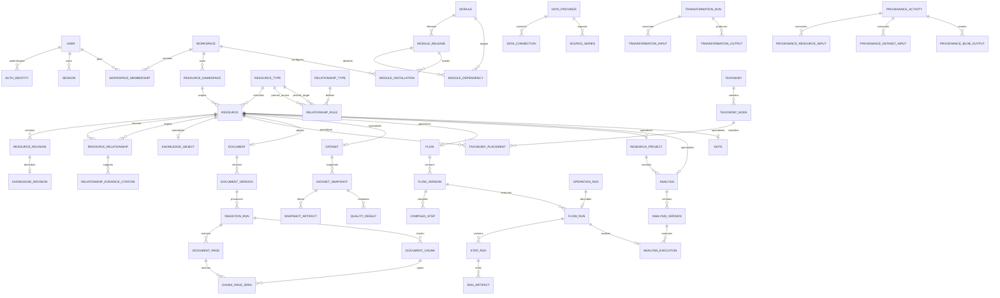

# JARVIS Data Model

- Status: Phase 0 baseline
- Date: 2026-08-18
- Related decisions:
  [PostgreSQL](decisions/0003-postgresql-primary-store.md),
  [workspace tenancy](decisions/0004-workspace-tenancy-and-rls.md), and
  [object storage](decisions/0007-object-storage-and-snapshots.md)

## 1. Goals

The model must:

- separate shared system knowledge from private workspace data;
- preserve referential integrity across heterogeneous resources;
- version knowledge, flows, documents, datasets, and analyses;
- record exact inputs and transformations for reproducibility;
- support configuration-driven modules without EAV modeling;
- support graph exploration without using an unenforceable
  `(entity_type, entity_id)` pattern;
- keep large immutable payloads outside ordinary relational rows;
- allow future collaboration without migrating from direct user ownership.

This document is conceptual. Alembic migrations will be the executable schema
source once implementation begins.

## 2. Global conventions

All primary keys are UUIDs and are opaque to clients. All mutable tables have
`created_at` and `updated_at` as `timestamptz`. User-visible mutable resources
may have `deleted_at`; immutable revisions and run evidence are retired or
tombstoned rather than rewritten.

Other conventions:

- timestamps are stored in UTC;
- workspace-owned rows carry non-null `workspace_id`;
- actor fields use `created_by_user_id`/`updated_by_user_id`;
- public slugs are unique within an explicit namespace, not globally;
- finite states use constrained text or database enums only when lifecycle
  stability justifies an enum;
- money/accounting values use `numeric` with an explicit currency/convention;
- high-volume observations may use `double precision`, preserving raw provider
  text or artifact hashes for audit;
- user-supplied text is never treated as trusted HTML;
- revision, snapshot, and completed-run rows are append-only.

Every table has an identified bounded-context owner. Cross-context writes occur
through application services.

## 3. PostgreSQL schemas

The database uses these logical schemas:

- `identity`
- `platform`
- `knowledge`
- `documents`
- `data`
- `flows`
- `research`
- `search`
- `ai`
- `governance`

The split documents ownership; it does not create separate databases.

## 4. High-level ERD



## 5. Identity and workspace model

### `identity.users`

Application profile only. It does not store an identity-provider password.

Key fields:

- `id`
- `display_name`
- `primary_email` as profile/contact data
- `status`
- `created_at`, `updated_at`, `disabled_at`

### `identity.auth_identities`

Maps an external identity to a user.

Key fields:

- `id`
- `user_id`
- `issuer`
- `subject`
- provider display metadata
- `last_authenticated_at`

Constraint: `(issuer, subject)` is globally unique. Email is not an identity
key.

### `identity.sessions`

Stores only a versioned keyed-HMAC digest of the opaque browser token.

Key fields:

- `id`, `user_id`
- `token_digest`, `digest_key_version`
- `created_at`, `last_seen_at`, `expires_at`, `revoked_at`
- `auth_time`, `mfa_context`
- safe client metadata

### `identity.oidc_login_transactions`

Short-lived, single-use records for expected issuer, state digest, PKCE
verifier (protected at rest), nonce, exact redirect/return path, creation/
expiry, and consumed timestamp. Callback consumes the row atomically. Raw
state or verifier values are never logged.

### `identity.workspaces`

The tenant and ownership boundary.

Key fields:

- `id`, `name`, `slug`
- `kind`: `personal` or `team`
- `status`
- `created_by_user_id`

### `identity.workspace_memberships`

Key fields:

- `workspace_id`, `user_id`
- `role_id`
- `status`
- `joined_at`

Constraint: one active membership per `(workspace_id, user_id)`.

### Roles and permissions

`roles`, `permissions`, and `role_permissions` define Owner, Admin, Editor,
and Viewer behavior. Permissions are stable action keys such as
`knowledge.read`, `flow.execute`, and `credential.rotate`. Provider claims do
not define application roles.

## 6. Resource identity and namespaces

Only objects that need stable links, search identity, tags, citations, or
cross-domain relationships become resources. Chunks, observations, step runs,
and similar internal records do not.

### `knowledge.resource_namespaces`

Key fields:

- `id`
- `kind`: `system` or `workspace`
- `workspace_id`, nullable only for `system`
- `name`, `slug`
- `read_only`

Invariants:

- exactly one default namespace per workspace;
- system namespaces are read-only to ordinary users;
- a workspace namespace belongs to exactly one workspace.

### `knowledge.resource_types`

Registry of trusted type keys such as:

- `concept`
- `definition`
- `formula`
- `method`
- `paper`
- `dataset`
- `flow`
- `research_project`
- `analysis`
- `note`

Type registration is delivered by trusted module releases.

### `knowledge.resources`

Stable resource envelope.

Key fields:

- `id`
- `resource_type_id`
- `namespace_id`
- `scope`: `system` or `workspace`
- `workspace_id`, required when scope is `workspace`
- `slug`
- `lifecycle_status`
- `current_revision_id`, a convenience pointer only
- `lock_version`, used only for optimistic mutation concurrency
- actor and timestamp fields

Constraints:

- `(id, resource_type_id)` is unique for typed relationship foreign keys;
- `(namespace_id, slug)` is unique among live resources;
- `scope = 'workspace'` if and only if `workspace_id` is non-null;
- workspace and namespace ownership agree;
- `(id, current_revision_id)` references a revision of that same resource.

### `knowledge.resource_drafts`

Mutable working state with `lock_version`, validation results, and last editor.
Drafts are not execution/citation targets. Type-specific draft tables hold
their content. Publishing validates a draft and creates a new immutable
resource revision.

### `knowledge.resource_revisions`

Immutable published content states.

Key fields:

- `id`, `resource_id`
- `revision_number`
- `content_hash`
- `authority`, `confidence`, `source_status`
- `created_by_user_id`, `created_at`, `published_at`
- `supersedes_revision_id`

Constraint: `(resource_id, revision_number)` is unique. Revisions are not
updated in place.

The `current_revision_id` pointer can move without altering historical
analyses, which always pin explicit revision IDs.
`resource_revision_lifecycle_events` record superseded, deprecated, withdrawn,
or restored control state without changing revision content. Access policy
derives effective lifecycle from those events and current pointers.

### Version identity matrix

Version concepts are deliberately distinct:

- `lock_version` protects updates to a mutable logical row;
- `revision_number` orders immutable content revisions of one resource;
- `semantic_version` identifies a compatible module, flow, handler, formula,
  or content release;
- object `storage_version` identifies an immutable provider object version;
- an execution attempt number orders retries of the same operation/step.

API fields use those names rather than an ambiguous `version`.

Every user-visible versioned specialization has a 1:1 revision link:

- knowledge revision -> resource revision;
- document version -> resource revision;
- dataset snapshot -> resource revision;
- published flow version -> resource revision;
- analysis version -> resource revision;
- note revision -> resource revision.

The subtype row and resource revision share scope/ownership. A deferred
constraint verifies that `current_revision_id` and `supersedes_revision_id`
belong to the same logical resource.

## 7. Typed knowledge objects

`knowledge.knowledge_objects` is a 1:1 specialization of `resources` for
knowledge content. `knowledge.knowledge_revisions` is a 1:1 specialization of
`resource_revisions` with common title, summary, body, difficulty, language,
and source metadata.

Typed revision tables include:

- `concept_revision_details`
- `definition_revision_details`
- `formula_revision_details`
- `formula_variables`
- `method_revision_details`
- `method_assumptions`
- `method_diagnostics`
- `framework_revision_details`
- `rule_revision_details`

Formula revisions store:

- canonical display LaTeX;
- a versioned, validated expression AST in JSONB;
- output units/dimensions;
- assumptions and domain constraints;
- relational variables with symbol, meaning, unit, and validation rules.

The expression AST is data for a safe evaluator. It is not passed to Python
`eval`.

## 8. Taxonomies and curricula

A common hierarchy supports CFA, Master's courses, future learning programs,
and non-finance subjects.

### `knowledge.taxonomies`

Defines a hierarchy such as `cfa-curriculum` or `masters-program`.

### `knowledge.taxonomy_nodes`

Key fields:

- `id`, `taxonomy_id`
- `parent_node_id`
- `node_type`: program, level, course, subject, topic, subtopic
- `stable_key`, `title`, `sort_order`
- validity/version metadata

The tree uses an adjacency list initially. Recursive CTEs are sufficient; a
closure table is added only if measured traversal performance requires it.

### `knowledge.taxonomy_placements`

Links a resource to a taxonomy node with role and ordering. A concept may
appear in multiple curricula without duplication.

## 9. Relationship graph

### `knowledge.relationship_types`

Defines predicates such as `related_to`, `explained_by`, `used_in`,
`requires`, `uses`, `studies`, `teaches`, and `contains`.

### `knowledge.relationship_rules`

Defines allowed triples:

`source_resource_type + relationship_type + target_resource_type`

The three IDs form a unique key.

### `knowledge.resource_relationships`

An immutable relationship assertion.

Key fields:

- `id`
- source resource ID and source type ID
- relationship type ID
- target resource ID and target type ID
- source and target revision IDs when the assertion is revision-specific
- assertion namespace/workspace
- status, confidence, provenance activity
- `created_by_user_id`, `created_at`, `withdrawn_at`

Composite foreign keys verify endpoint IDs and endpoint types. A foreign key
to `relationship_rules` verifies that the triple is allowed.

The assertion's own scope controls endpoint policy:

- a system-owned assertion may connect only two system resources;
- a workspace-owned assertion may use a source and target that are each either
  in that same workspace or system owned. This permits system-to-workspace,
  workspace-to-system, workspace-to-workspace, and system-to-system
  directions inside a private workspace assertion.

It always forbids an endpoint in another workspace. The application service
validates this, and a database constraint trigger provides defense in depth
because ordinary foreign keys cannot express the same-workspace-or-system rule
alone.

### Relationship evidence

Evidence uses target-specific junctions with real foreign keys:

- `relationship_evidence_citations`
- `relationship_evidence_resource_revisions`
- `relationship_evidence_document_chunks`
- `relationship_evidence_dataset_snapshots`
- `relationship_evidence_notes`

Each row belongs to one relationship assertion. It is not represented as a
generic `(target_type, target_id)` pair. Withdrawing an assertion does not
destroy its evidence.

The generic graph is for discovery and explanation. Execution-critical
relations—flow inputs, analysis datasets, and transformation lineage—remain
typed tables.

## 10. Modules and workspace configuration

### `platform.modules`

Stable module identity: key, name, description, ownership, and lifecycle.

### `platform.module_releases`

Immutable manifest release with semantic version, code digest, configuration
schema, compatibility range, and published status.

### `platform.module_dependencies`

Declared by one module release and targeting a stable module plus semantic
version range. It does not foreign-key directly to one target release.

`module_dependency_resolutions` records the exact target release selected for
an installation. A workspace may have only one active release of a module.

### `platform.module_capabilities`

Stable globally unique capability identity: permission, route, component,
provider, handler, or AI tool key.

`module_release_capabilities` declares which stable capabilities and
implementation versions a release provides. Reusing the same stable key in a
later release is expected; duplicate ownership by another module is rejected.

### `platform.navigation_nodes`

Configuration for trusted route/component keys, parent node, label, icon key,
sort order, and visibility expression.

### `platform.module_installations`

Workspace-to-release installation with enabled state and schema-validated
configuration JSONB.

No module table contains executable imports or source code.

## 11. Documents and citations

### `governance.blobs`

Storage-independent object metadata:

- `id`, `workspace_id`
- storage provider/key/version
- SHA-256, size, media type
- encryption and retention metadata
- created/finalized/quarantined/deleted timestamps

Deduplication is scoped to one workspace/security domain by default. Blob
authorization and reference counts never disclose whether another workspace
holds identical bytes.

### `documents.documents`

Resource specialization for a logical paper/document.

### `documents.document_versions`

Immutable original or replacement version:

- `id`, `document_id`, `resource_revision_id`
- `original_blob_id`
- filename, media type, checksum, page count
- title, DOI, publication metadata
- upload/finalization status

### `documents.ingestion_runs`

One processing attempt for a document version and pipeline release. Records
status, parser/OCR versions, job ID, start/end time, warnings, and failure
details.

### `documents.document_pages`

Page number, page label, extracted-text hash, dimensions, and optional
layout-artifact reference.

### `documents.document_chunks`

Immutable chunk text with:

- character or token offsets;
- section label;
- extraction run and hash;
- FTS vector;
- safe citation locator.

`chunk_page_spans` maps a chunk to one or more pages with page-relative start
and end locators. This permits a chunk to cross a page boundary while retaining
enforceable page/extraction ownership.

### `documents.chunk_embeddings`

Optional projection keyed by `(chunk_id, embedding_model_release_id)`. It is
rebuildable and never replaces source text.

### `knowledge.citations`

A citation pins a document version, extraction run, page/chunk locator, and
optional quote hash. It never points only to a mutable logical document.

Composite constraints verify that the extraction belongs to the document
version and that every page, chunk, and span belongs to that extraction.

## 12. Data, snapshots, and transformations

### `data.data_providers`

Trusted provider key, release, and capability metadata.

### `data.data_connections`

Workspace-scoped configuration and secret credential reference. No plaintext
secret is stored or returned.

### `data.source_series`

Provider series catalog: source identifier, metadata, units, frequency, and
provider revision timestamps.

### `data.datasets`

Resource specialization for a logical named dataset.

### `data.dataset_snapshots`

Immutable exact dataset state:

- `id`, `dataset_id`, `resource_revision_id`
- stage: raw, normalized, analysis
- schema hash, canonical semantic hash, and artifact byte hash
- retrieval/as-of/vintage range
- row/column counts
- producer activity and status

### `data.snapshot_columns`

Name, logical/physical type, units, currency, timezone, role, nullability, and
source mapping.

### `data.snapshot_artifacts`

Links snapshots to Parquet/Arrow/raw-response blobs with partition and format
metadata.

### `data.series_observations`

Optional relational store for moderate interactive time series:

- workspace/source series;
- observation date/time;
- value;
- real-time/vintage start and end;
- retrieval/source revision;
- quality flags.

Partition only after volume warrants it.

### Transformations

`transformation_definitions` and immutable `transformation_releases` describe
allowlisted operations. `transformation_runs`, `transformation_inputs`, and
`transformation_outputs` create exact lineage between snapshots.

Parameters include units, frequency, missing-data policy, window, lag, and
annualization conventions. A transformation never silently overwrites its
input.

### Quality

`quality_runs` and `quality_results` record checks for missing values,
duplicates, date gaps, frequency, outliers, unit/currency mismatches, stale
observations, and revisions. Results have severity, affected range, evidence,
and disposition.

## 13. Flow definitions and runs

### `flows.flows`

Resource specialization for a logical flow.

### `flows.flow_drafts`

Mutable workspace-only authored state with `lock_version`, validation results,
and last editor. Drafts are not executable and are not referenced by completed
runs. Publishing snapshots a draft into a new resource revision and immutable
flow version.

### `flows.flow_versions`

Immutable published DSL with `resource_revision_id`, semantic/schema version,
compiled hash, and publication metadata. Deprecation/withdrawal is recorded as
a separate lifecycle event/pointer; published content is not rewritten.

### `flows.compiled_steps` and `flows.compiled_edges`

Validated execution plan. Each step pins a registered handler release and its
validated configuration. Edges map typed outputs to typed inputs.

### `flows.handler_releases`

Stable key/version, code digest, schemas, capabilities, determinism, timeout,
retry, and idempotency policy. Each release belongs to a module release and
references an execution image/bundle digest plus retention status.

### `flows.flow_runs`

1:1 flow-specific subtype of a canonical `governance.operation_run`, with:

- exact flow version;
- requested/started/completed actor and times;
- status and cancellation state;
- code/image/dependency lock hashes;
- random seed and environment metadata;
- input/output manifest hashes.

### `flows.step_runs`

One or more attempts per step. Records handler release, idempotency key,
status, timing, input/output references, warnings, error category, and retry
metadata.

### `flows.run_artifacts`

`run_artifacts` is an immutable common envelope with ID, workspace, producing
operation/step, artifact kind, media/schema metadata, semantic hash, optional
byte hash, and creation time. It has exactly one 1:1 typed subtype:

- `run_artifact_blobs`
- `run_artifact_dataset_snapshots`
- `run_artifact_resource_revisions`
- `run_artifact_structured_results`

The envelope gives API artifact references and provenance one enforceable
foreign-key target; kind must match the present subtype through a deferred
constraint. Each subtype has a real foreign key and the same workspace scope.
Charts, tables, diagnostics, and reports are typed structured-result or blob
subtypes, not polymorphic IDs.

## 14. Research memory

### `research.research_projects`

Resource specialization with objective, status, owner workspace, and
project-level relationships.

### `research.project_resources`

Typed project membership for concepts, papers, datasets, methods, flows,
analyses, and notes.

### `research.analyses`

Resource specialization for a logical analysis within a project.

### `research.analysis_versions`

Immutable resource revision and research specification that pins:

- objective and assumptions;
- flow version;
- dataset snapshots;
- concept/formula/method revisions;
- parameters and conventions;
- expected outputs.

### `research.analysis_executions`

Associates an analysis version with exactly one flow run and records review,
interpretation, conclusion, and reproducibility status.

### `research.experiments`

Groups comparable executions and declared comparison metrics. It does not
create a second execution engine.

### `research.notes`

Workspace-scoped resource specialization with immutable note revisions.
Typed junctions target resources or exact revisions. Markdown is stored as
source text and rendered through a safe sanitizer.

## 15. Provenance, audit, and events

Audit and provenance have different purposes.

### `governance.operation_runs`

Canonical globally addressable envelope for document ingestion, provider
imports, transformations, quality checks, flow execution, report generation,
and other durable work.

Key fields:

- `id`, `workspace_id`, `kind`;
- requested actor/session and correlation ID;
- canonical status and progress;
- `lock_version`, cancellation state, timestamps;
- dispatcher/queue reference and attempt generation;
- safe error/warning summary.

Canonical states are `pending_dispatch`, `queued`, `running`,
`waiting_for_input`, `retrying`, `succeeded`,
`succeeded_with_warnings`, `failed`, `cancel_requested`, and `cancelled`.
Domain run tables are optional 1:1 subtypes and map richer domain states to the
envelope. Cancellation ownership and the API status URL belong to the envelope.

### `governance.audit_events`

Append-oriented security/accountability facts:

- workspace, actor, session/request ID;
- action and resource;
- timestamp and outcome;
- before/after hashes or safe changed-field metadata;
- IP/client data under a defined retention policy.

Secrets, document text, prompts, and full financial datasets are excluded.

### `governance.provenance_activities`

Represents an import, extraction, transformation, flow run, analysis, or
publication event. It records:

- activity type and implementation release;
- actor/service;
- start/end time;
- configuration and environment hashes;
- status and warnings.

Provenance uses target-specific junctions:

- `provenance_input_resource_revisions` and matching output table;
- `provenance_input_dataset_snapshots` and matching output table;
- `provenance_input_blobs` and matching output table;
- `provenance_input_run_artifacts` and matching output table.

Each has a real foreign key, explicit workspace/scope validation, and ordinal
or role. This is a constrained W3C PROV-inspired model, not a polymorphic ID
or generic event dump.

### `governance.outbox_events`

Written in the same transaction as domain state. Consumers use stable event
IDs and idempotency records to update search projections or enqueue work.
Outbox records are not the permanent audit log.

For jobs, the creating transaction writes `operation_run` in
`pending_dispatch` plus an outbox event. An idempotent dispatcher enqueues and
advances it to `queued`. Attempt generation/fencing prevents a stale worker
from committing after lease loss.

### AI records

The `ai` schema owns:

- conversations and messages;
- prompt-template releases;
- model invocation records;
- AI tool calls and confirmation decisions;
- retrieved evidence junctions;
- token/usage metadata and safe output status.

Conversation/tool records are workspace scoped. Evidence uses the same
target-specific foreign-key pattern. The AI schema owns no authoritative
calculation result.

## 16. Search and tags

### `knowledge.tags` and `knowledge.resource_tags`

Tags are scoped to system or workspace namespaces. Tagging does not replace
typed taxonomies or relationships.

### `search.search_entries`

Disposable projection by resource revision:

- title and body search vectors;
- facets such as type, taxonomy, authority, status, and workspace;
- ranking fields and source revision hash.

### `search.search_embeddings`

Future disposable projection keyed by source revision/chunk and embedding
model release. PostgreSQL FTS remains the initial query path.

Search projections can be rebuilt from authoritative tables and artifacts.

## 17. Tenant isolation

RLS applies to all private operational tables. Conceptually, a policy permits a
row when:

```text
row.workspace_id = current_transaction_workspace()
and current_user_is_member()
```

System catalog reads use a separate explicit policy. Writes to system
namespaces require a controlled administrative role.

Rules:

- API transactions set workspace/user/session context with `SET LOCAL`;
- a locked-search-path, non-recursive security-definer membership function
  verifies active membership/role against identity tables; it is owned by a
  controlled role and is the only membership bypass exposed to policies;
- workspace equality and membership are both validated before private access;
- connection-pool checkout never inherits prior transaction context;
- worker jobs carry a signed/scoped workspace and actor reference, then
  revalidate active permission and establish the same transaction context;
- private child tables either carry `workspace_id` with composite foreign keys
  or are protected through a tested parent-bound security view/policy; absence
  of direct scope is never implicit;
- all caches, object keys, search documents, and job idempotency keys include
  workspace scope;
- elevated migration/maintenance roles are not used by application traffic.

Tests attempt reads, writes, joins, relationship creation, search, signed URL
generation, and worker execution across two workspaces.

### Scope inheritance

Every assertion/reference has an owning scope. The allowed target matrix is:

- system-owned records may target only system records;
- workspace-owned records may target the same workspace or system records;
- no record may target another workspace.

This applies to relationships, taxonomy placements, evidence, citations,
provenance, tags, blobs/artifacts, project membership, search, and AI
retrieval—not only graph edges. Composite foreign keys are used where
possible; a narrowly scoped deferred constraint trigger enforces
same-workspace-or-system cases.

### Required composite integrity

The executable schema must enforce:

- current/superseding revisions belong to the same resource;
- relationship endpoint revisions belong to their endpoint resources;
- taxonomy parents belong to the same taxonomy;
- module dependency resolutions satisfy their declared target/range;
- document pages/chunks/spans/citations belong to the pinned extraction and
  document version;
- dataset snapshot artifacts belong to their snapshot/workspace;
- operation subtypes and run artifacts belong to their operation/workspace;
- analysis executions reference the analysis version and flow run in the same
  workspace.

## 18. Storage boundaries

PostgreSQL stores:

- identity, ownership, permissions, and sessions;
- module configuration and trusted capability references;
- resource envelopes, immutable revision metadata, and typed knowledge;
- graph rules, relationships, and citations;
- document/page/chunk metadata and searchable text;
- provider catalogs, snapshot schemas, quality results, and lineage;
- flow definitions, compiled plans, runs, and step state;
- projects, analyses, notes, audit, provenance, and outbox state.

Object storage stores:

- original PDFs and immutable document derivatives;
- raw provider payloads;
- Parquet/Arrow snapshots;
- large charts, reports, model artifacts, and logs required for reproduction.

JSONB stores only versioned and schema-validated:

- module settings;
- formula expression ASTs;
- authored flow DSL and parameter manifests;
- sparse provider metadata;
- structured diagnostics and result summaries.

Frequently filtered JSONB fields graduate to relational columns. Entire
application state, executable code, and unversioned mutable aggregates do not
belong in JSONB.

## 19. Deletion and retention

- User-facing deletion first marks a logical resource deleted.
- Published revisions, completed runs, audit events, and cited evidence remain
  immutable under the retention policy.
- A purge job removes eligible private blobs and rows after a grace period,
  preserving required tombstones and audit facts.
- System content is withdrawn or superseded, not silently deleted.
- A legal/privacy deletion path is designed separately from normal archive.
- Orphan detection reconciles object storage against `blobs` and references.

## 20. Initial migration slice

The foundation should create only:

- users, auth identities, sessions;
- workspaces, memberships, roles, and permissions;
- resource namespaces, types, resources, and revisions;
- modules, releases, capabilities, and installations;
- audit and outbox tables;
- RLS policies and application/migration roles.

Knowledge, document, data, flow, and research tables follow in vertical-slice
migrations. This preserves the full model without creating unused tables
before their behavior is implemented and tested.

