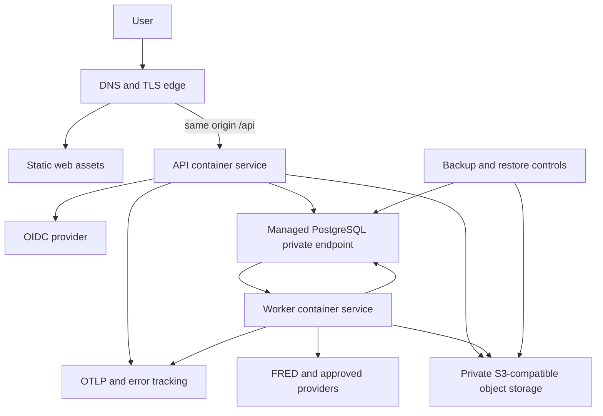

# JARVIS Deployment Strategy

- Status: Phase 0 baseline
- Date: 2026-08-18
- Target posture: cloud-ready personal launch with portable managed services

## 1. Deployment principles

- Build deployable containers and static assets, not infrastructure-specific
  application code.
- Keep web, API, and worker independently deployable.
- Use one PostgreSQL database and S3-compatible object store initially.
- Expose only the edge/web/API; keep database, storage administration, and
  worker interfaces private.
- Serve the workstation and `/api` under one origin.
- Run migrations as one controlled task before rollout, never from replicas.
- Prefer managed PostgreSQL/object storage/secrets for production while using
  standards-based adapters.
- Do not introduce Kubernetes without a measured need.

## 2. Environments

### Local target profile

Runs on Windows/macOS/Linux with Docker Compose:

- PostgreSQL 18;
- MinIO or filesystem-backed development object storage;
- FastAPI API;
- worker process when a durable job exists;
- static Vite dev/build server;
- local OIDC test provider or protected development identity configuration.

Source processes may run on the host for fast reload while dependencies remain
in containers. Root commands are cross-platform and do not assume Bash.

Phase 1 delivers PostgreSQL 18.6 and runtime-role bootstrap through Compose,
while the FastAPI and Vite processes run on the host for reload. Object storage,
workers, and a local OIDC fixture are added only with their approved features;
they are not falsely represented in the current Compose file.

### CI target profile

Uses ephemeral PostgreSQL and S3-compatible containers, synthetic fixtures,
and a test OIDC issuer. CI has no production credentials or data.

Phase 1 CI currently runs PostgreSQL 18.6 plus mocked cryptographically signed
OIDC exchanges. S3-compatible services are deferred until object storage enters
the implemented scope.

### Staging

Mirrors production topology with lower capacity and separate accounts,
database, buckets, keys, OIDC application, and provider credentials. Staging
does not use copied production documents/data unless a separate approved and
sanitized process exists.

### Production

Runs static web assets, API container replicas, worker container replicas,
managed PostgreSQL, private S3-compatible storage, OIDC, KMS/secrets, and
observability services.

## 3. Logical topology



The diagram shows logical dependencies, not a requirement that a worker poll
directly from a database replica. The PostgreSQL-backed queue uses the primary
database with bounded connections.

## 4. Same-origin routing

Production routes:

```text
https://app.example/
https://app.example/assets/*
https://app.example/api/v1/*
https://app.example/api/v1/auth/login
https://app.example/api/v1/auth/callback
https://app.example/api/v1/auth/logout
```

The edge/CDN serves static files and proxies all `/api` paths, including OIDC
login/callback/logout, to FastAPI. Unknown
non-asset browser paths fall back to `index.html`.

Benefits:

- host-only secure session cookie;
- no broad CORS;
- simpler Origin/CSRF policy;
- one public application origin.

API responses containing private data are not cached by a shared CDN. Static
fingerprinted assets are immutable and long cached.

## 5. Portable production profiles

### Low-operations profile

A container PaaS may host API/worker, with managed PostgreSQL, managed
S3-compatible storage, managed OIDC, and managed secret/KMS services.

Requirements:

- private or TLS-enforced database connection;
- one-off migration task;
- separate API/worker commands and scaling;
- health checks and rolling deployment;
- workload secret injection;
- object versioning and backup support;
- logs/metrics export.

### AWS reference profile

The first explicit reference mapping is:

- static assets: S3 plus CloudFront or equivalent edge;
- API/worker: ECS Fargate services;
- database: RDS PostgreSQL 18-compatible release;
- objects: private S3 buckets with versioning;
- keys/secrets: KMS and Secrets Manager;
- container registry: ECR;
- DNS/TLS: Route 53 and ACM;
- telemetry: OpenTelemetry to a selected backend plus error tracking.

This is a reference, not a domain-code dependency. R2, another managed
PostgreSQL provider, or a conformant OIDC provider remain valid behind ports.

## 6. Build artifacts

Release artifacts are:

- versioned static web bundle;
- API OCI image;
- worker OCI image, normally based on the same Python package lock;
- normalized OpenAPI document and generated client;
- Alembic migration set;
- versioned content packages;
- SBOM and build provenance.

Images:

- use multi-stage builds;
- run as a non-root numeric user;
- use read-only root filesystems where possible;
- write only to explicit temporary volumes;
- contain no source credentials;
- pin base images by digest for release;
- receive Git commit, image digest, and dependency lock hash metadata.

API and worker may share a base image but use distinct entry points and
resource limits.

## 7. Configuration and secrets

Configuration is validated at process startup and separated into:

- non-secret environment configuration;
- platform secrets resolved from deployment secret management;
- workspace provider credentials resolved through the encrypted secret store.

Startup fails clearly for missing/invalid required settings. It never logs
secret values.

Use workload identity rather than long-lived cloud keys. Database/object/KMS
permissions are least privilege and differ for API, worker, migration, and
backup roles.

## 8. Network and edge controls

- TLS is required in production.
- Database and administrative object-store endpoints are private.
- Security groups/firewall rules allow only required service paths.
- Parser/OCR workers have no general outbound network access.
- Provider-enabled workers use destination allowlists or controlled egress.
- The edge enforces request/upload limits consistent with API policy.
- Trust proxy headers only from the configured edge.
- Apply strict transport, content security, frame, MIME, and referrer headers.
- Production CORS is absent or restricted to explicitly approved non-browser
  clients; same-origin browser requests are the default.

## 9. Object-store layout

Use separate buckets or strongly separated prefixes for:

- quarantine uploads;
- accepted originals;
- raw provider data;
- processed document artifacts;
- dataset snapshots;
- analysis/report artifacts;
- temporary exports.

Object keys are opaque and workspace scoped. Buckets are private, block public
access, encrypt at rest, and enable versioning where supported. Lifecycle rules
may expire quarantine failures and temporary exports, but never delete cited
originals or analysis snapshots without reference/retention checks.

The database stores object version and hash. Signed URLs are short lived and
issued only after application authorization.

## 10. Database deployment

PostgreSQL requirements:

- latest security-patched supported 18 release;
- encrypted storage and TLS connections;
- automated backups and point-in-time recovery;
- parameter/extension configuration under change control;
- separate owner/migration and application/worker roles;
- application roles cannot bypass RLS;
- connection pool budgets divided between API, worker, migrations, and
  operations;
- slow query, lock, connection, storage, and replication/backup monitoring.

Initial required extensions should remain minimal: `pg_trgm` and extensions
needed for UUID/crypto behavior. PostgreSQL FTS is built in. `pgvector` is
added only with semantic-search implementation and operational review.

## 11. Jobs and workers

The first durable queue is PostgreSQL-backed through the `JobQueue` port after
the candidate adapter passes migration, rolling-upgrade, stalled-recovery,
dead-letter, and conformance spikes.

Worker deployment:

- independent replica count and resource sizing;
- queues separated by workload class when needed;
- bounded concurrency and DB connections;
- graceful shutdown stops accepting work and checkpoints/cancels safely;
- jobs use IDs/references, not large payloads or plaintext secrets;
- canonical `operation_run` state is authoritative;
- domain operation and outbox are created atomically; dispatcher handoff is
  idempotent and recoverable;
- attempt generation/fencing prevents stale workers from committing after
  lease loss;
- active permission is revalidated before sensitive work/side effects;
- heartbeats/stalled-job recovery and dead-letter inspection;
- CPU/memory/time/artifact limits;
- quarantine verification/document extraction run in a no-egress pool with
  separate IAM from provider-enabled workers;
- analytics/provider pools advertise supported handler/bundle/contract ranges.

Dispatch routes work only to compatible workers. Releases retain required
execution images by digest according to policy, drain incompatible workers
before contract migrations, and distinguish exact historical rerun from
current-method rerun.

A dedicated broker or orchestration service is introduced only when measured
database contention, throughput, or workflow complexity warrants it.

## 12. Release process

1. Build, test, scan, and identify immutable artifacts.
2. Back up and verify target environment readiness.
3. Run migration preflight and one locked expand migration task.
4. Apply required versioned bootstrap/content prerequisites in documented
   order.
5. Deploy compatible workers and verify their advertised capability ranges.
6. Deploy API release compatible with old and expanded schema.
7. Deploy static web bundle.
8. Drain incompatible workers before any contract migration.
9. Run smoke tests for auth, health, DB, storage, and golden path.
10. Resume controlled backfills/content imports.
11. Observe errors, latency, queue lag, and numerical regression signals.
12. Promote or roll back application images; contract schema only in a later
   release.

Feature flags/module installation may hide incomplete capabilities, but they
do not replace migration compatibility.

## 13. Health and readiness

API:

- liveness checks process health only;
- readiness verifies required configuration and essential dependency access
  without expensive queries;
- a deeper protected diagnostic checks database migrations, storage, OIDC
  metadata, and provider setup.

Worker:

- liveness verifies event loop/process;
- readiness verifies queue/database and required storage;
- heartbeat and queue lag expose operational health.

External provider failure degrades only the relevant capability. It does not
make the entire API unready.

## 14. Observability

Use structured JSON logs and OpenTelemetry-compatible trace propagation across
HTTP, outbox, jobs, provider calls, and analysis execution.

Common safe fields:

- timestamp, severity, service/release;
- request/correlation/causation ID;
- job/run ID and safe resource ID;
- workspace ID where policy permits operational use;
- error code and duration;
- provider/handler key and version.

Excluded by default:

- secrets and authorization headers;
- document text;
- raw provider responses/data values;
- prompts and model output;
- personal notes;
- signed URLs.

Monitor:

- request rate, latency, and errors;
- database connections, locks, slow queries, storage, and backup status;
- queue depth/lag/retries/dead letters;
- worker CPU/memory/timeouts;
- parser and provider failure rates;
- FRED rate limits;
- flow/analysis duration and cancellation;
- object upload/finalization/orphan errors;
- AI tool authorization/citation failures when enabled.

Audit, research provenance, and telemetry remain separate stores/concepts.

## 15. Backup and disaster recovery

Back up:

- PostgreSQL with point-in-time recovery;
- object storage through versioning/replication or provider backup controls,
  retaining exact versions for at least the PostgreSQL PITR horizon;
- KMS key material/configuration and recovery controls sufficient to decrypt
  every retained protected object/secret;
- infrastructure and deployment configuration;
- content packages and application release artifacts, including retained
  execution images required by the rerun policy.

Initial service objectives:

- target recovery point: no more than 15 minutes for PostgreSQL after the
  production MVP;
- object and KMS recovery point no weaker than the supported PostgreSQL PITR
  point;
- target recovery time: four hours for the personal production deployment;
- immutable uploaded originals and analysis snapshots protected through object
  versioning and reconciliation.

These are design targets, not guarantees, until restore drills demonstrate
them.

Quarterly or before high-risk migrations:

1. quiesce ingress, dispatch, and workers in the recovery environment;
2. restore PostgreSQL to the selected point;
3. restore exact object versions and required KMS access for that point;
4. reconcile blobs, operation/outbox/queue/idempotency state, and any recorded
   external side effects before workers resume;
5. verify representative objects and semantic/byte hashes;
6. verify RLS/roles, encrypted credentials, and session revocation;
7. run migrations only if the recovered application release requires them;
8. run golden-path and numerical integrity tests;
9. resume workers/ingress under observation;
10. record achieved RPO/RTO and remediation.

## 16. Scaling policy

Scale in this order:

1. measure and optimize queries/indexes;
2. tune connection pools and worker concurrency;
3. scale API/worker replicas horizontally;
4. partition high-volume observation tables if needed;
5. add narrowly scoped cache/read replicas where measured;
6. extract a workload only for independent scaling/failure/security needs.

Likely extraction candidates:

- document processing;
- heavy analytics;
- provider ingestion;
- search indexing/query;
- AI orchestration.

Do not extract identity, platform registry, knowledge, or research
orchestration during early product validation.

## 17. Cost controls

- Start with the smallest managed database meeting backup/security needs.
- Scale workers to zero or low idle capacity where the platform permits.
- Apply lifecycle rules to temporary/quarantine/rebuildable artifacts.
- Record provider and AI usage by workspace/run without sensitive payloads.
- Set upload, dataset, analysis, and AI quotas before public multi-user access.
- Do not pay for a separate vector database, broker, or Kubernetes control
  plane before the corresponding need exists.

## 18. Deployment gates

Production deployment is blocked until:

- CI test/security gates pass;
- migration from prior version succeeds;
- application roles/RLS are verified;
- secret and config validation pass;
- TLS/private storage/database controls are active;
- backups and at least one restore drill have succeeded;
- health/alerts and rollback commands are documented;
- owner login, upload/download authorization, and the current golden path pass
  smoke tests;
- known issues and residual risk are recorded.

## 19. Deferred infrastructure

Not part of the initial deployment:

- Kubernetes;
- service mesh;
- separate graph/vector/search databases;
- multi-region active-active;
- bespoke event bus;
- GPU fleet;
- public plugin execution;
- data warehouse/lakehouse.

These may be introduced only through a new ADR with measured requirements.

