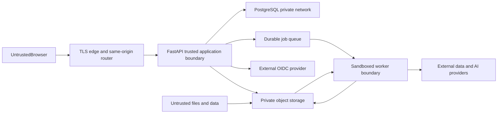

# JARVIS Threat Model

- Status: Phase 0 baseline
- Date: 2026-08-18
- Review cadence: before each major phase and after any trust-boundary change

## 1. Scope and assumptions

This model covers the cloud-ready web application, FastAPI API, PostgreSQL,
object storage, worker, OIDC provider, data-provider integrations, document
processing, and future AI tool gateway.

Initial assumptions:

- one invited owner uses the first production deployment;
- the service is reachable from the public internet;
- the browser and `/api` are served under one origin;
- OIDC, object storage, KMS/secrets, FRED, and optional AI providers are
  external trust domains;
- uploaded research papers and imported data are untrusted;
- no brokerage trading, payment initiation, or bank-account write access is
  included in the architecture-validation MVP;
- collaboration and open registration are disabled initially, but isolation
  controls are implemented and tested from the first migration.

## 2. Security objectives

JARVIS must protect:

- confidentiality of documents, datasets, notes, research, and conversations;
- confidentiality and controlled use of FRED/AI/provider credentials;
- identity sessions and workspace membership;
- integrity of formulas, calculations, methods, citations, and provenance;
- isolation between workspaces;
- availability of research records and reproducible artifacts;
- auditability without putting sensitive content into telemetry;
- the distinction between verified, user, imported, and AI-generated content.

The security model does not claim that analytical output is investment advice
or that third-party data is correct. It ensures the system can show what source
and method produced a result.

## 3. Actors and adversaries

- **Authorized owner/member**: may make mistakes, upload hostile files, or
  misuse high-impact features.
- **External attacker**: seeks account takeover, session theft, service
  exploitation, denial of service, or data theft.
- **Malicious future tenant**: attempts IDOR, cross-workspace links, search
  leakage, worker/cache collisions, or resource exhaustion.
- **Malicious document/data source**: exploits parsers or injects instructions
  into AI context.
- **Compromised provider**: returns malicious payloads, leaks credentials, or
  provides incorrect/tampered data.
- **Compromised dependency/build system**: introduces code or artifact
  tampering.
- **Privileged operator**: has infrastructure access beyond ordinary users;
  actions require least privilege and audit.
- **AI model/provider**: is not trusted with authorization decisions,
  deterministic calculations, secrets, or unsupported factual claims.

## 4. Trust boundaries

Important transitions:

- browser input crossing into API validation;
- authenticated identity becoming JARVIS user/workspace context;
- API/worker transactions establishing RLS context;
- signed upload objects moving from quarantine to accepted storage;
- untrusted documents/data entering parser and AI context;
- application services resolving encrypted provider credentials;
- tool requests moving from an AI model to authorized domain services.

## 5. Authentication and session threats

### Account takeover

Threats:

- stolen identity-provider account;
- weak or absent MFA;
- email-based identity confusion;
- open registration creating unauthorized users.

Controls:

- OIDC Authorization Code with PKCE, state, nonce, and strict redirect URI;
- exact issuer allowlist; approved algorithms; JWKS signature/key-rotation;
  `iss`, `aud`/`azp`, expiry, issued-at, nonce, and `auth_time` validation;
- single-use, short-lived server-side state and PKCE verifier;
- map identities by immutable `(issuer, subject)`, never email;
- provider-enforced MFA for owner/admin roles;
- `(issuer, subject)` owner allowlist/invitation and disabled open registration;
- audit successful/failed login and membership/role changes;
- revoke sessions when an identity or user is disabled.

### Session theft and fixation

Controls:

- high-entropy opaque session token;
- store only a versioned keyed-HMAC digest with a verification-key rotation
  procedure;
- `__Host-` cookie with Secure, HttpOnly, SameSite=Lax, path `/`, no Domain;
- rotate after login, privilege change, and suspicious events;
- idle and absolute expiry;
- no session or provider tokens in browser storage, URLs, logs, or analytics;
- revoke on logout and expose session management to the owner.

### CSRF, login CSRF, and open redirect

Controls:

- Origin validation on mutations;
- server-issued CSRF token bound to session;
- state/nonce verification during OIDC callback;
- exact allowlist for post-login return paths and redirect URIs;
- no wildcard production CORS.

## 6. Authorization and workspace-isolation threats

Threats:

- insecure direct object reference;
- trusting `workspace_id` from a request body;
- missing workspace filter in an API query;
- stale RLS context reused through connection pooling;
- background worker processing a job under the wrong workspace;
- cross-workspace resource relationship;
- search result, cache, metric, or signed URL leaking another workspace;
- elevated migration/table-owner role used by application traffic.

Controls:

- explicit workspace path scope plus membership validation;
- payload schemas exclude ownership fields;
- non-null workspace ownership and composite tenant-aware foreign keys;
- PostgreSQL RLS on private tables;
- `SET LOCAL` user/workspace context inside each transaction;
- a locked-search-path, non-recursive security-definer function verifies
  active membership/role; its controlled owner is not an application role;
- API and worker roles neither own tables nor have `BYPASSRLS`;
- worker permission is revalidated before sensitive execution and side effects;
- database constraint for same-workspace-or-system graph links;
- workspace-prefixed object keys, caches, search entries, jobs, and
  idempotency records;
- signed object URLs generated only after resource authorization and expiring
  quickly;
- two-workspace adversarial integration suites for API, DB, worker, search,
  graph, export, and storage paths;
- controlled, separately audited maintenance roles.

Fail closed if transaction security context is absent or invalid.

## 7. Credential and secret threats

Threats:

- keys committed to Git or exposed in frontend bundles;
- plaintext user credentials in PostgreSQL backups;
- keys returned by APIs, config export, or exception details;
- credentials serialized into job/event payloads;
- log/trace capture of authorization headers, prompts, URLs, or provider
  responses;
- unrestricted worker access to every workspace secret.

Controls:

- platform secrets in managed secret storage or local development environment;
- envelope encryption for user-provided keys with master keys in KMS;
- per-secret ciphertext, encrypted data key, nonce, algorithm, and key version;
- bind ciphertext to workspace ID, secret record ID, provider/purpose, and key
  version through AEAD associated data;
- API responses expose only configured status, fingerprint, and rotation date;
- jobs/events carry opaque secret references;
- resolve only inside an authorized scoped operation;
- central structured-log redaction and safe exception mapping;
- no secrets in configuration export;
- audit create, use, rotate, and revoke without plaintext;
- least-privilege workload identities and key-rotation procedures.

## 8. Upload and document-processing threats

Threats:

- MIME spoofing and malicious PDF parser payloads;
- decompression/page/object bombs and resource exhaustion;
- encrypted or malformed files causing parser hangs;
- path/key traversal;
- malware distribution through stored originals;
- OCR/parser network egress or SSRF;
- citation drift after silent reprocessing;
- direct access to quarantine or private documents.

Controls:

- constrained presigned uploads with opaque server-generated keys;
- private quarantine prefix, file-size limits, and content-length enforcement;
- the API records upload metadata but does not parse hostile PDF structure;
- a no-egress quarantine verifier worker checks magic bytes, MIME, checksum,
  encryption, and page/object limits before promotion;
- scan for malware where deployment risk warrants it;
- non-root, read-only, resource-limited verifier/extractor workers with
  credentials separate from provider-enabled workers;
- no network egress from parser/OCR containers;
- CPU, memory, file, page, and wall-clock limits;
- patched parsers and license/security review;
- immutable original and versioned extraction pipeline;
- page/chunk hashes and stable citation locators;
- short-lived authorized downloads with safe content disposition;
- explicit ingestion failure state rather than partial publication.

The application never renders unsanitized extracted HTML or executes embedded
document content. PDF.js runs with embedded scripts/actions disabled,
external-link policy, restrictive CSP, and a separate viewer origin/sandbox if
browser testing shows same-origin isolation is insufficient.

## 9. Data-provider and import threats

Threats:

- provider URL manipulation or SSRF;
- unbounded response size and malformed payload;
- rate-limit amplification;
- provider credential exposure;
- tampered or revised data presented as original;
- spreadsheet formula injection on export;
- wrong units/frequency/currency leading to unsafe analysis.

Controls:

- providers use fixed trusted base URLs and typed parameters;
- no arbitrary URL in ordinary provider requests;
- response byte/time/row limits and schema validation;
- bounded retries with jitter and provider-aware rate limiting;
- raw response artifact, request metadata, retrieval time, and checksum;
- FRED/ALFRED vintage metadata and clear backtest-safety status;
- explicit units, frequency, currency, and transformation provenance;
- data-quality checks before analysis;
- neutralize spreadsheet formula prefixes during CSV/Excel export;
- provider conformance and hostile-response tests.

## 10. Flow and analytics threats

Threats:

- arbitrary code, SQL, shell, or imports in flow configuration;
- handler confused-deputy access to unrestricted services;
- oversized DAG or inputs causing denial of service;
- duplicate side effects under at-least-once delivery;
- hidden transformation or numerical convention;
- malicious chart/report content;
- formula AST injection.

Controls:

- versioned JSON Schema DSL with allowlisted handler keys;
- publish-time compiler, schema compatibility, permission, and DAG limits;
- no executable source/import/class names in database definitions;
- handlers receive narrow scoped ports, not raw database/network/filesystem;
- per-step timeout, memory/artifact-size limits, cancellation, and quotas;
- stable idempotency keys, checkpoints, and bounded retries;
- safe expression AST evaluator, never `eval`;
- explicit numeric units, rounding, day-count, annualization, and seed;
- pure deterministic engines with golden/property tests;
- safe chart specification schema and output sanitization.

### Queue and stale-worker controls

The domain transaction writes a canonical operation plus outbox event. An
idempotent dispatcher performs queue handoff, and undispatched events are
recoverable. Each claim receives an attempt generation/fencing token; a worker
that loses its lease cannot commit outputs. Cancellation is cooperative,
permission is revalidated before side effects, and dead letters have an
explicit operator/owner workflow.

## 11. AI and prompt-injection threats

Threats:

- uploaded text instructs the model to reveal secrets or call tools;
- model invents formulas, citations, data, or statistical results;
- model requests unauthorized workspace resources;
- provider retains sensitive prompts/documents;
- tool output causes indirect prompt injection;
- model performs a write or expensive analysis without informed consent;
- cross-user conversation or retrieval leakage.

Controls:

- treat model and retrieved text as untrusted;
- no direct database, shell, filesystem, arbitrary network, or secret tools;
- tools invoke normal application services and repeat authorization;
- strict typed schemas, size limits, and output redaction;
- begin with read-only tools;
- explicit confirmation and idempotency for future write/execute tools;
- retrieve by workspace-scoped services and exact source revisions;
- factual claims/citations require tool evidence;
- deterministic calculations come only from engines;
- label fact, calculation, inference, interpretation, and opinion;
- AI-generated knowledge remains draft;
- record provider/model/version, tool calls, evidence, and result status;
- configurable provider data-retention policy and minimum necessary context;
- prompt-injection and tool-authorization adversarial tests.

## 12. Integrity and reproducibility threats

Threats:

- artifact replacement at the same object key;
- revision pointer changes altering a historical analysis;
- dependency/model upgrade changing results;
- clock/randomness not captured;
- audit record modification;
- data revision or stale cache shown as original result.

Controls:

- immutable/versioned object storage and SHA-256 verification;
- analyses pin resource revisions, flow/handler releases, and dataset snapshots;
- record image/Git/dependency lock/engine/model hashes;
- controlled clock and random seed;
- append-oriented audit and provenance records;
- signed release artifacts and SBOM;
- search/cache treated as disposable projections;
- periodic integrity verification and backup restore drills.

## 13. API and browser threats

Controls include:

- strict request/body/header limits and Pydantic validation;
- RFC 9457 safe error responses without stack traces;
- parameterized SQL through the data layer;
- output encoding and a restrictive Content Security Policy;
- no unsafe inline script or unsanitized Markdown/HTML;
- clickjacking protection;
- content sniffing protection and safe file disposition;
- per-session/IP/provider rate limits with careful proxy trust;
- ETag/If-Match for lost-update protection;
- idempotency keys for retriable mutations;
- dependency on HTTPS only in production.

## 14. Supply-chain and deployment threats

Threats:

- malicious or compromised package;
- vulnerable PDF/native dependency;
- poisoned container/base image;
- leaked CI credential;
- unsigned/untraceable production build;
- accidental public database/bucket.

Controls:

- pinned lockfiles and reviewed dependency updates;
- dependency, license, CodeQL/Semgrep, secret, and container scanning;
- SBOM for release images;
- minimal non-root, read-only, multi-stage containers pinned by digest;
- short-lived workload identity in CI/deployment;
- protected environments and least-privilege deploy roles;
- private network/database/object storage defaults;
- infrastructure review and automated policy checks;
- release provenance/signatures when the deployment pipeline is established.

## 15. Availability and abuse threats

Controls:

- request, upload, query, result, and flow graph limits;
- per-workspace quotas and provider rate control before multi-user launch;
- durable bounded retries and dead-letter handling;
- worker concurrency and database-connection limits;
- cancellation and time budgets for analytics;
- health/readiness endpoints and queue-lag monitoring;
- PostgreSQL point-in-time recovery and object versioning;
- restore drills and documented degraded modes;
- no synchronous PDF processing or large analysis in API requests.

## 16. Privacy and data minimization

- Collect only identity profile fields required by the application.
- Do not put document text, prompts, financial values, or provider responses in
  default telemetry.
- Define retention for sessions, IP data, audit events, AI conversations, raw
  provider data, and failed uploads.
- Provide workspace export and deletion semantics before public multi-user use.
- Document AI-provider retention and training settings.
- Keep production data out of development/test environments.
- Use synthetic fixtures in CI.

## 17. Security verification gates

Before the foundation is deployable:

- threat model reviewed;
- OIDC state/nonce/PKCE and redirect tests pass;
- cookie, rotation, revocation, Origin, and CSRF tests pass;
- cross-workspace API/DB/storage/search/worker tests pass;
- application roles are verified not to bypass RLS;
- secret redaction and config-export tests pass;
- backup and restore drill succeeds;
- dependency, secret, and container scans run in CI.

OIDC/session/RLS/cross-workspace tests run against the exact release commit and
cannot be replaced by a stale scheduled result. CI also smoke-tests root
tooling on Windows. Only extended fuzz, load, and resilience suites may move to
protected scheduled gates.

Before document ingestion:

- parser benchmark and license/security review completed;
- upload limits, quarantine, sandbox, timeout, and malformed-file tests pass;
- citation remains stable across extraction versions.

Before AI tools:

- read-only evidence APIs are complete;
- prompt-injection and cross-workspace adversarial tests pass;
- no direct arbitrary execution/network/secret tools exist;
- provider retention and redaction settings are documented.

Before public multi-user access:

- open registration/invitation abuse controls;
- quotas and rate limiting;
- privacy export/deletion;
- incident response and operational access review;
- external security review or focused penetration test.

## 18. Residual risks and accepted constraints

- A compromised application runtime can access data available to its workload
  identity; encryption at rest does not solve runtime compromise.
- Privileged cloud/database operators and loss of KMS keys remain high-impact
  trust risks; access audit, dual control where available, and key backup/
  recovery policy reduce but do not remove them.
- OIDC/provider availability affects login and external data/AI features.
- Parser sandboxing reduces but does not eliminate native-library risk.
- Malware scanning is policy/deployment dependent and cannot guarantee a file
  is benign.
- PostgreSQL RLS errors remain possible; layered authorization and tests are
  mandatory.
- Queue locks/load share the OLTP database until a broker is justified.
- Database and object-store writes are not one atomic transaction; finalize,
  compensation, reconciliation, and retention reduce inconsistency windows.
- Append-oriented audit rows are not cryptographically tamper-evident in the
  first deployment.
- Authenticated XSS could act with a user's session despite HttpOnly cookies;
  CSP, output sanitization, and dependency controls remain critical.
- A user can intentionally share an unexpired signed URL; expiries and
  revocation reduce but do not eliminate bearer-link risk.
- AI output remains probabilistic and may be wrong despite evidence controls.
- Third-party source correctness and licensing require ongoing review.
- Initial RPO/RTO and cross-store recovery are unproven until restore drills.
- Retaining historical execution images improves exact reruns but increases
  vulnerability-management and storage burden.
- Multi-region disaster recovery is not provided initially.
- The first deployment does not provide regulated trading, custody, or payment
  functionality.

These risks are revisited when capabilities or deployment exposure change.

## 19. Incident-response minimum

The production profile must support:

1. revoke sessions and disable identities/workspaces;
2. rotate platform and user-provided credentials;
3. disable a provider, module, flow handler, or AI tool release;
4. quarantine documents and block downloads;
5. preserve audit/provenance evidence;
6. identify affected workspaces and artifact versions;
7. restore PostgreSQL/object data to a verified point;
8. document timeline, impact, remediation, and required user notification.

